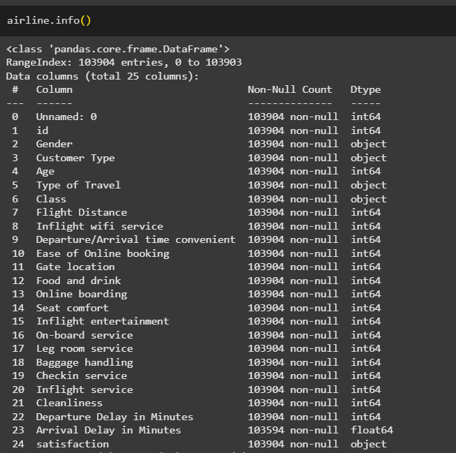
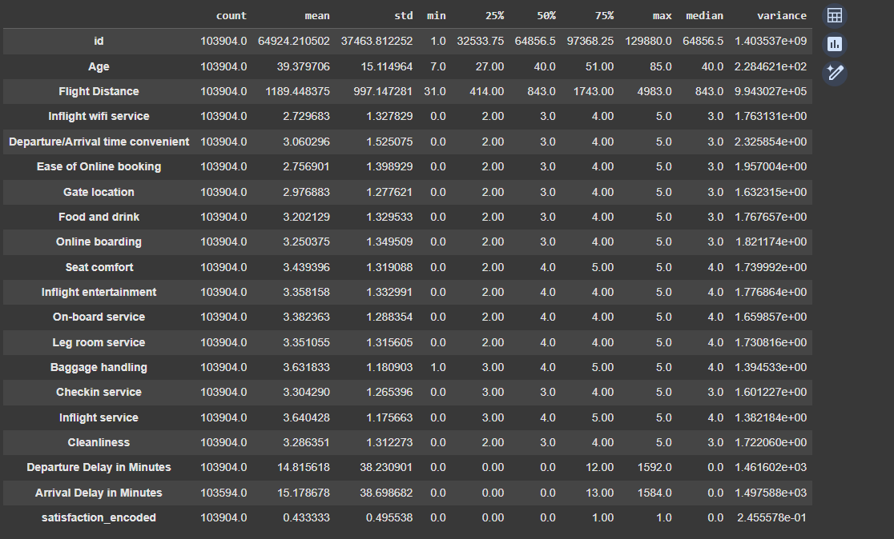
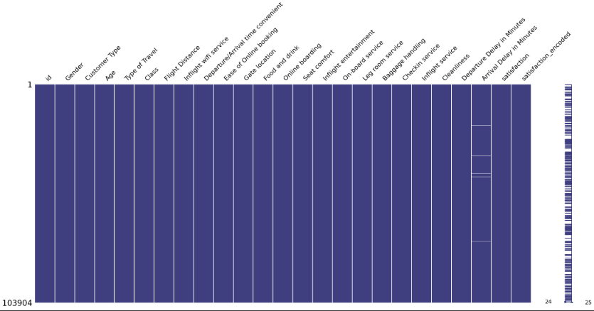
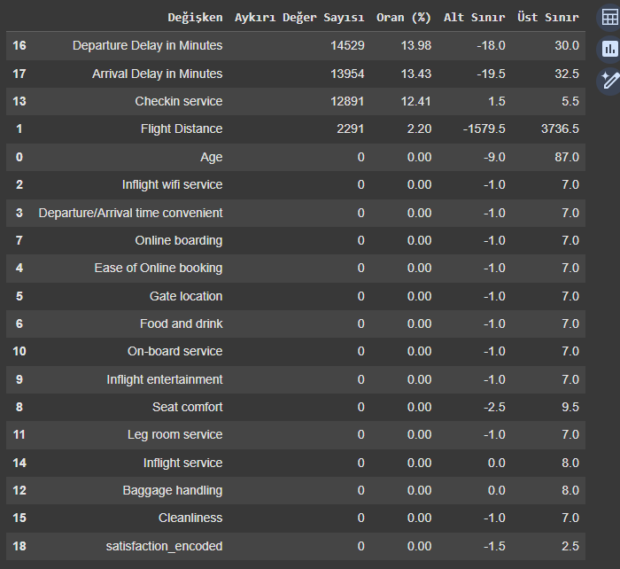
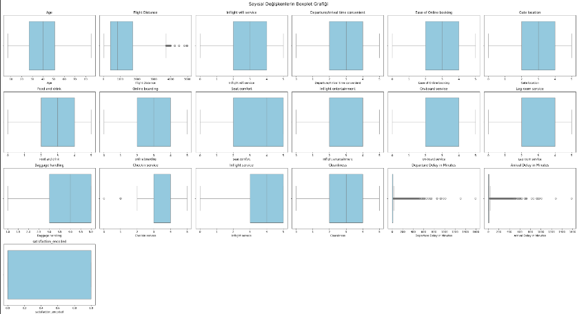
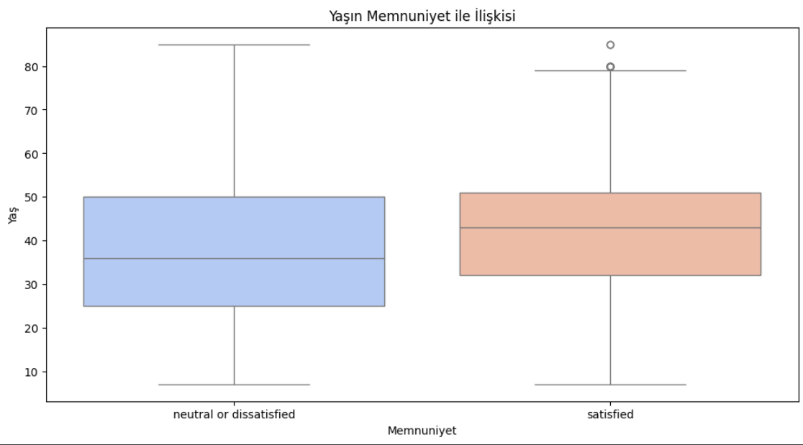
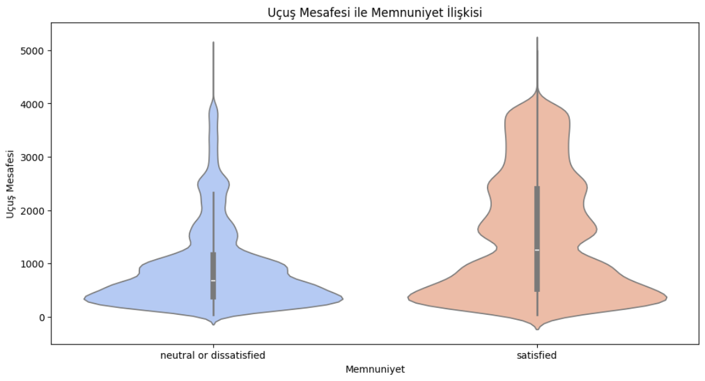
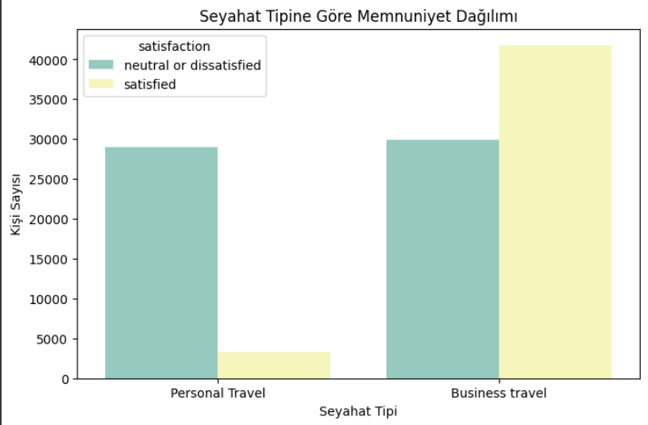
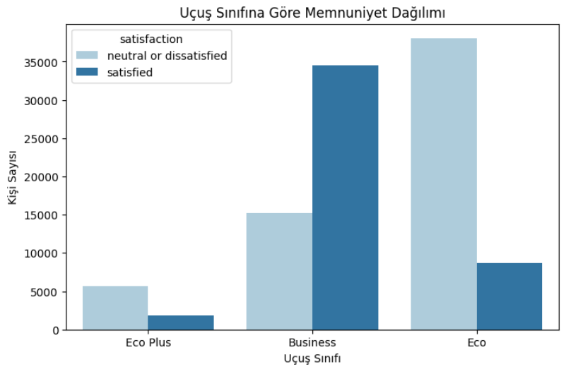
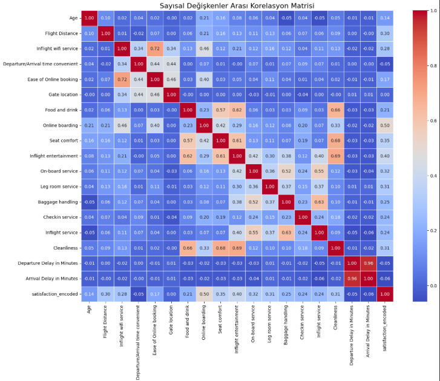

# Veri-Analizi
# ✈️ Airline Passenger Satisfaction Analysis

Bu proje, bir havayolu şirketine ait yolcu memnuniyet verilerini kullanarak memnuniyet düzeyini etkileyen faktörleri incelemeyi amaçlamaktadır. Python kullanılarak yapılan bu analiz, temel istatistiksel özetler, eksik değer incelemesi, aykırı değer tespiti, görselleştirme ve değişkenler arası ilişki analizlerini içermektedir.

---

## 📌 Proje Amacı

Havayolu hizmetleri kapsamında toplanmış olan yolcu verilerini analiz ederek:
- Yolcu memnuniyetini etkileyen faktörleri ortaya çıkarmak
- Eksik verileri uygun şekilde ele almak
- Aykırı değerleri belirlemek
- Görsel analizlerle öngörüleri desteklemek

---

## 📁 Kullanılan Veri Seti

Veri seti: **Airline Passenger Satisfaction**  
- Toplam satır sayısı: 103,904  
- Sütun sayısı: 25  
- Hedef değişken: `satisfaction` (categorical: *satisfied* / *neutral or dissatisfied*)  
- Sayısal ve kategorik değişkenler birlikte yer almaktadır.

  

---

## 🔍 Ana Analiz Adımları

### 1. Veri Setinin Tanıtımı ve Ön İşleme
- `Unnamed: 0` sütunu veri dışı bırakıldı
- `satisfaction` sütunu `satisfaction_encoded` olarak sayısal forma dönüştürüldü (0/1)

### 2. İstatistiksel Özetler
- Ortalama, medyan, standart sapma gibi özetler hesaplandı
- Simetrik/çarpık dağılım yapıları değerlendirildi

### 3. Eksik Değer Analizi
- `Arrival Delay in Minutes` değişkeninde %0.3 oranında eksik veri bulundu
- **Medyan ile doldurma** stratejisi tercih edildi (dağılım çarpık olduğu için)
📊 **Eksik Veri Görselleştirmesi:**

### 4. Aykırı Değer (Outlier) Analizi
- IQR yöntemi ile aykırı değerler belirlendi
- Boxplot grafikleri ile sayısal değişkenlerdeki uç değerler görselleştirildi

  
  
📊 **Boxplot – Sayısal Değişkenler:**

### 5. Görselleştirme
- Sayısal değişkenler için histogram ve KDE grafikleri
- Kategorik değişkenler için çubuk grafikleri
- `satisfaction` ile yaş, uçuş mesafesi, hizmet puanları arasındaki ilişkiler (boxplot / violinplot / countplot)
📊 **Memnuniyet – Yaş İlişkisi:**

📊 **Memnuniyet – Uçuş Mesafesi (Violinplot):**

📊 **Seyahat Tipi ve Memnuniyet:**

📊 **Uçuş Sınıfı ve Memnuniyet:**

### 6. Korelasyon Analizi
- Sayısal değişkenler arasında korelasyon matrisi çizildi
- `satisfaction_encoded` ile olan ilişkiler incelendi
📊 **Korelasyon Matrisi:**

---

## 📷 Örnek Görseller

- Sayısal ve kategorik dağılımlar
- Memnuniyet durumuna göre hizmet kalitesi karşılaştırmaları
- Eksik değer dağılımı bar chart
- Korelasyon matrisi heatmap

---

## 🛠️ Kullanılan Kütüphaneler
- pandas
- numpy
- matplotlib
- seaborn

---

## 📁 Çalışma Dosyası

Proje Jupyter Notebook dosyası:  
📄 `Proje.ipynb`

---

## ✍️ Not

Bu analiz, istatistiksel çıkarım ve veri ön işleme sürecine odaklanmaktadır. Modelleme (makine öğrenmesi) adımı bilinçli olarak kapsam dışında bırakılmıştır.
